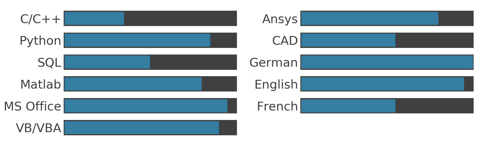

# The Skill Plotter: Overview

This little package will help you visualize the skills of you for your CV, presentations or similar.
Instead of using some designer software like Illustrator or just the office package we are going to use matplotlib and python.
Because, well, we can.

## Installation

The skill plotter package is available as a CLI command and can be installed via pip:


```bash
pip install skillplotter
```

## Usage

Just use the CLI command to run the plotter:

```bash
skillplotter x y z
```
<!-- TODO: Add command interface -->

## Development

### Minimal Requirements

```
- Python 3.9
- matplotlib 3.8
```

## Examples

Here you can see an example of the generated svg. Currently there are always two equal divided columns, in the future there will be the option to choose between one to three columns.


