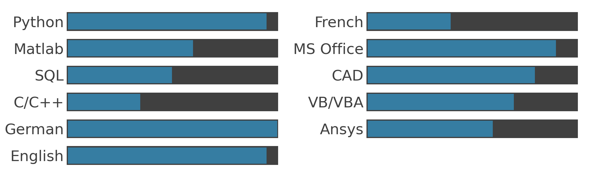
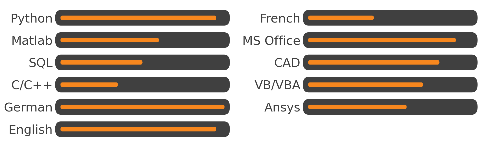
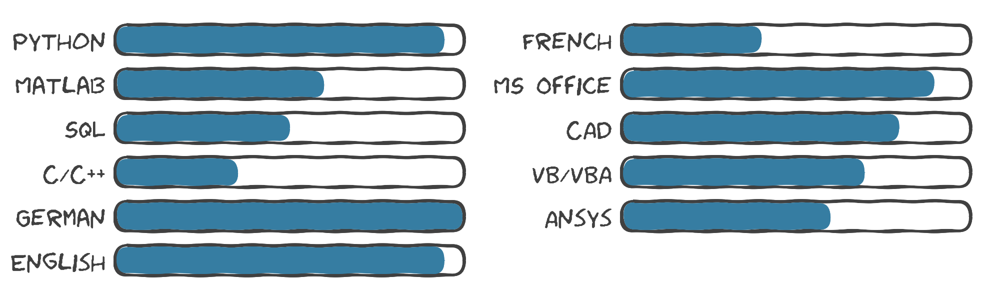
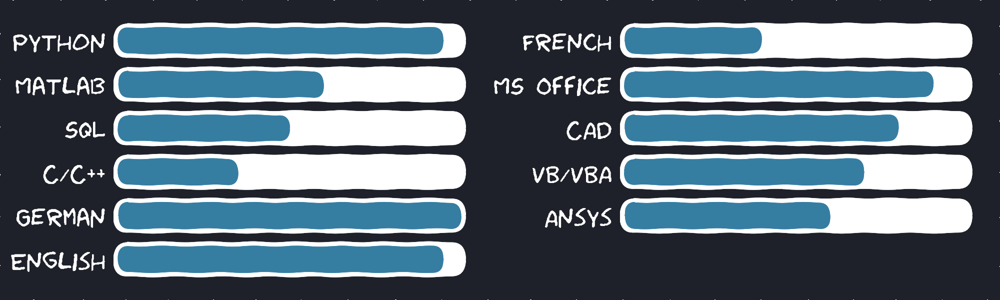

Welcome to the Skill Plotter documentation.
The Skill Plotter is a Python Command Line Interface (CLI) tool to create skill plots for your CV or other documents.
It can be used to easily and interactively create the plots.
Instead of using some designer software like Illustrator or just the office package we are going to use matplotlib and python.
Because, well, we can.

Here you will find everything to get started!

### Some Examples

<figure markdown>
  
  <figcaption>Default Settings</figcaption>
</figure>

<figure markdown>
  
  <figcaption>Using round, smaller bar height + orange</figcaption>
</figure>

<figure markdown>
  
  <figcaption>Using round, outline, xkcd</figcaption>
</figure>

<figure markdown>
  
  <figcaption>Using round, xkcd, changed color</figcaption>
</figure>